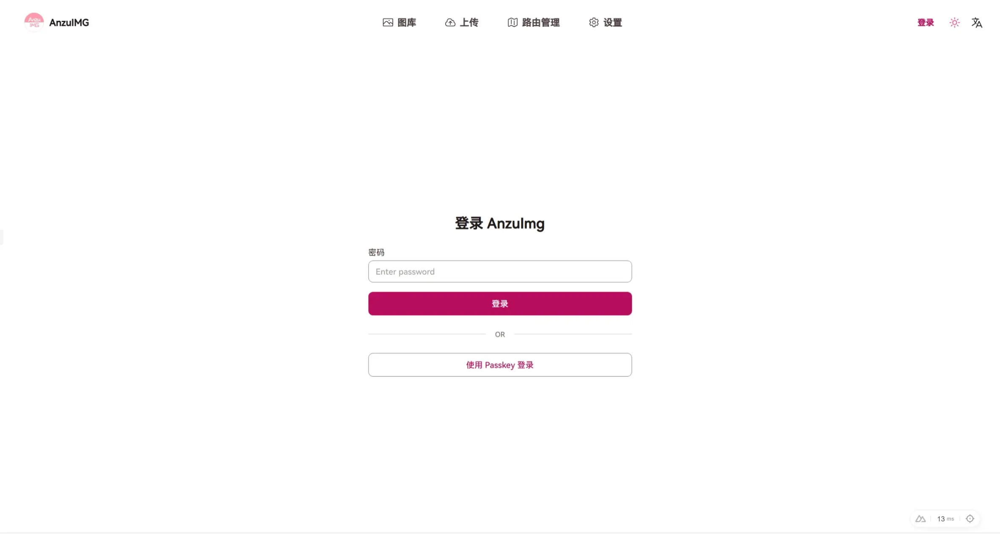
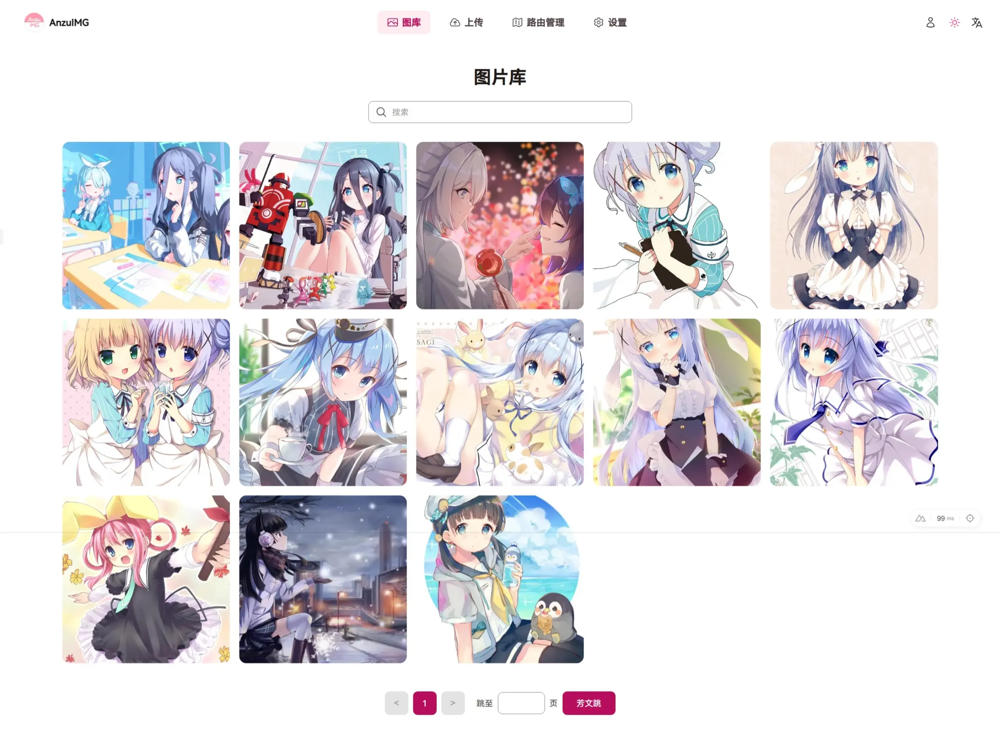
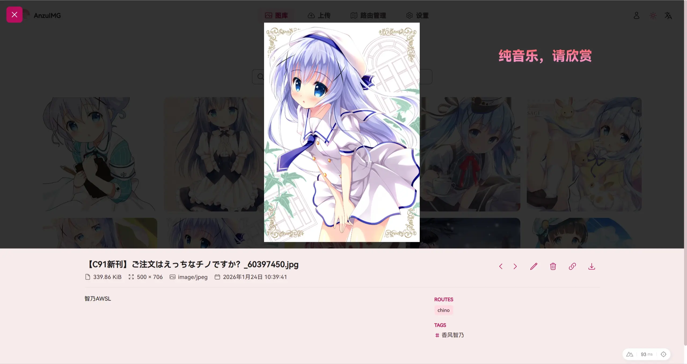
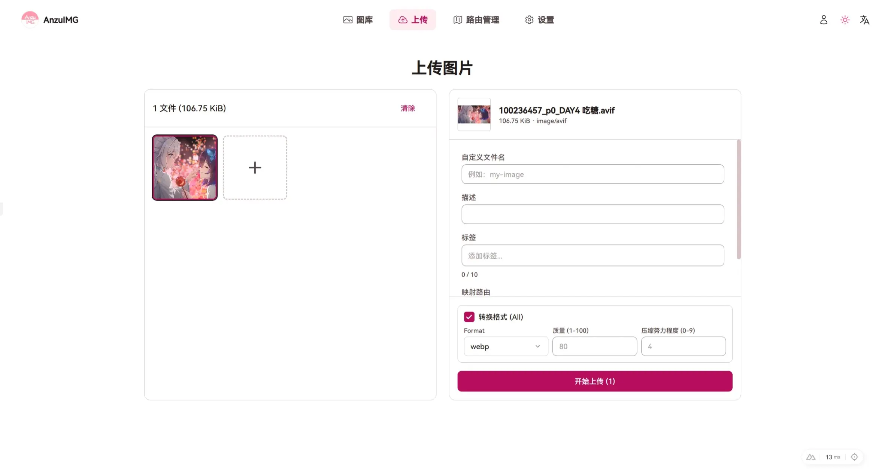
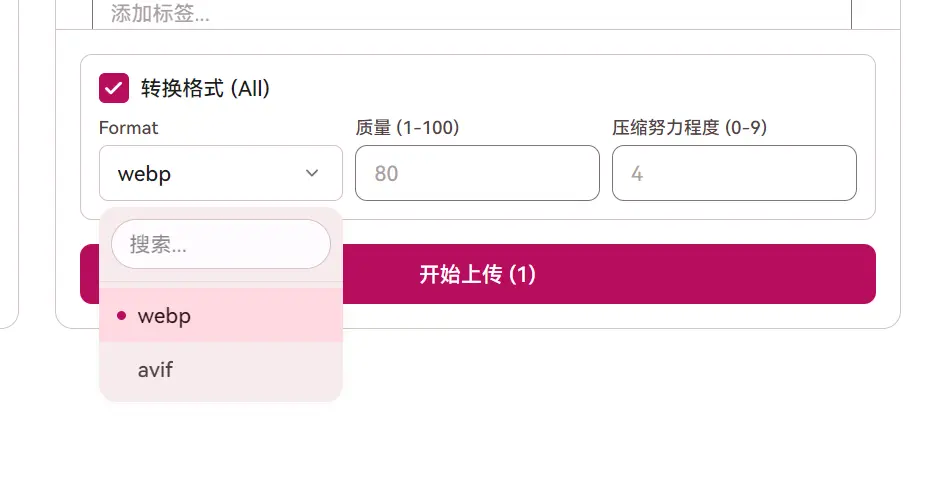
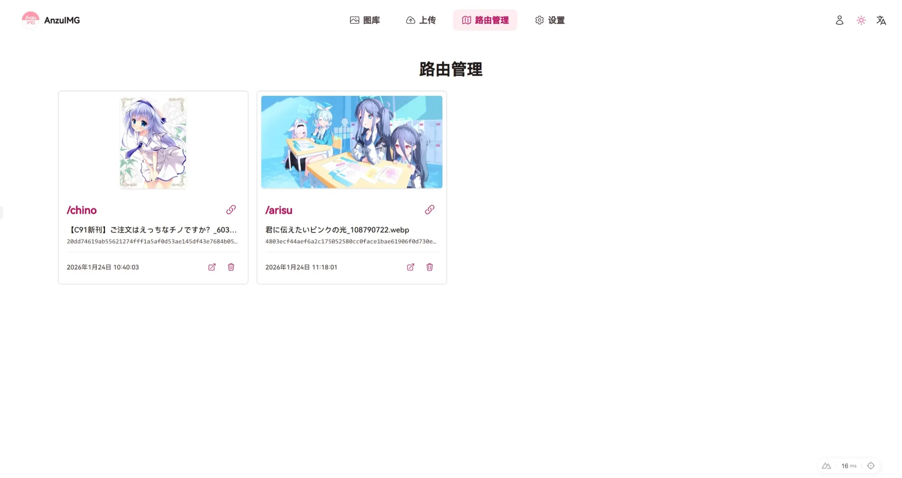
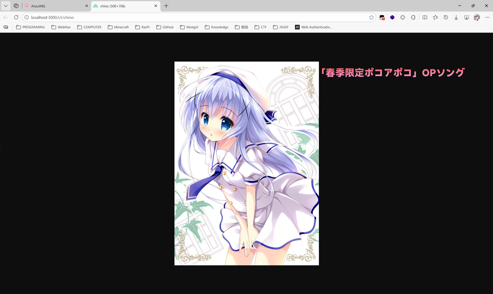
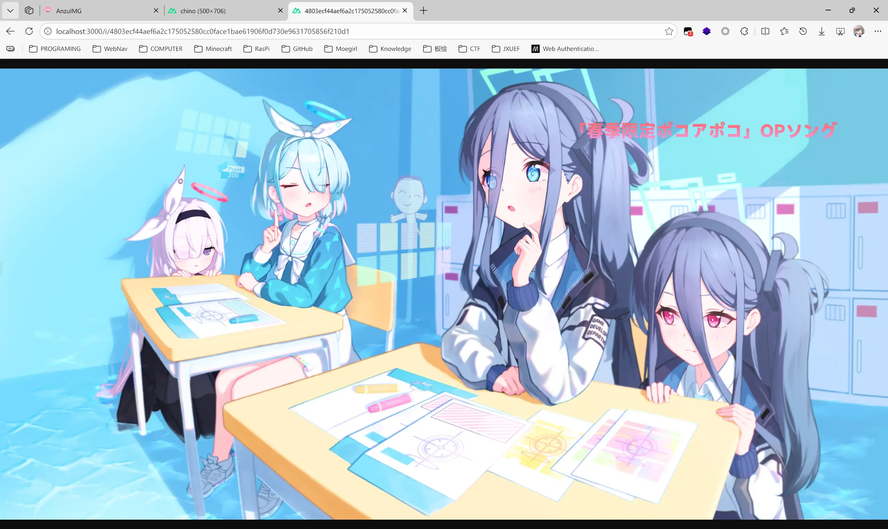
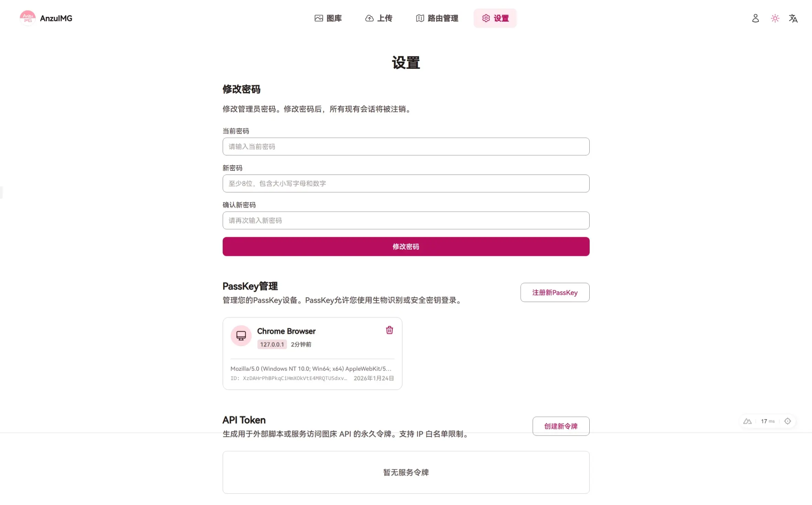

# AnzuImg

## 简介

一个基于 Go 语言 + Nuxt 打造的图床后。使用了[vipsgen](https://github.com/cshum/vipsgen)（[libvips](https://github.com/libvips/libvips)的 Go 语言实现），理论上能够良好地处理主流文件格式以及新兴的`webp`、`avif`、`jpxl`格式

## 部署

使用前请先配置.env文件，样例文件位于`deploy/.env.example`中

```

# 后端配置

# 监听地址
ANZUIMG_SERVER_ADDR=:8080

# 数据库
# 主机地址
ANZUIMG_DB_HOST=db
ANZUIMG_DB_PORT=5432
ANZUIMG_DB_USER=anzuuser
ANZUIMG_DB_PASSWORD=anzupass
ANZUIMG_DB_NAME=anzuimg
# SSL模式: disable, require, verify-full
ANZUIMG_DB_SSLMODE=disable

# 存储 local / cloud
ANZUIMG_STORAGE_TYPE=local
# 本地存储路径
ANZUIMG_STORAGE_BASE=/data/images

# S3云存储配置，当 TYPE=cloud 时生效
ANZUIMG_CLOUD_ENDPOINT=s3.amazonaws.com
ANZUIMG_CLOUD_BUCKET=anzuimg-bucket
ANZUIMG_CLOUD_REGION=us-east-1
ANZUIMG_CLOUD_ACCESS_KEY=
ANZUIMG_CLOUD_SECRET_KEY=
ANZUIMG_CLOUD_USE_SSL=true

# 网络/安全
# 允许跨域的源，通常就是前端访问地址
ANZUIMG_ALLOWED_ORIGINS=http://localhost:9200
# 信任代理网段 ，用于获取真实IP
ANZUIMG_TRUSTED_PROXIES=127.0.0.1,::1,10.0.0.0/8,172.16.0.0/12,192.168.0.0/16
# 初始化设置Token ，留空则不校验，但是在生产环境中将不接受外网访问
ANZUIMG_SETUP_TOKEN=
# Cookie SameSite策略：Lax/Strict
ANZUIMG_COOKIE_SAMESITE=Lax
# 严格Session IP绑定
ANZUIMG_STRICT_SESSION_IP=false

# Passkey (WebAuthn)
# 一般填写域名 youdomain.cn
ANZUIMG_PASSKEY_RP_ID=localhost
# 一般填写浏览器访问的完整URL
ANZUIMG_PASSKEY_RP_ORIGIN=http://localhost:9200
ANZUIMG_PASSKEY_RP_DISPLAY_NAME=AnzuImg

# 上传限制
# 单次请求最大体积 (MB)
ANZUIMG_MAX_UPLOAD_MB=110
# 单个文件最大体积 (MB)
ANZUIMG_MAX_UPLOAD_FILE_MB=60
# 单词请求最大文件数
ANZUIMG_MAX_UPLOAD_FILES=20

# 前端配置
# 后端API地址
BACKEND_URL=http://backend:8080

```

使用docker

```bash
docker compose -f deploy/docker-compose.yml up -d
```

> [!CAUTION]
>
> 首次运行，前端将引导进行初始化密码，如果没有配置 `ANZUIMG_SETUP_TOKEN`，后端将只接受本地路径访问进行初始化
>
> 如果使用了CDN服务，请关闭严格IP模式，否则无法正常访问控制服务
>
> 务必正确配置CORS
>
> cloud存储策略我没有测试过

### 生产部署建议

虽然 Nuxt 前端的 Nitro 支持 proxy，但生产环境仍建议把 **宿主机 Nginx 作为唯一对外入口**。

本项目现在支持“子路径部署 + API 前缀”，推荐对外暴露 3 个入口：

- **图床前端**：`/clannd/`（可配置）
- **图床后端 API**：`/kotori/`（可配置，通常只承载 `/api/v1/*`、`/health`）
- **图片直链**：`/i/`（公开访问）

对应前端环境变量：

- `APP_BASE_URL=/clannd/`（前端挂载路径，必须以 `/` 结尾）
- `API_PREFIX=/kotori`（API 前缀，置空或 `/` 表示不加前缀）
- `BACKEND_URL=http://backend:8080`（前端 SSR/Nitro 侧用于 proxy 的后端地址）

示例 Nginx 配置见 [`deploy/nginx/anzuimg.conf.example`](deploy/nginx/anzuimg.conf.example)。

## API

请阅读[API文档](README/API.md)

## 示例

### 登录页



登录的时候支持密码登录与Passkey登录（Passkey需要自行注册）

### 图库页



点击图片可以查看详情



> [!TIP]
>
> 在此模态框下，可以拖拽图片、缩放图片、编辑图片信息等操作

### 上传页



> [!TIP]
>
> 上传页支持**多文件上传**，也支持对图片格式进行**转换**



### 路由管理页



> [!TIP]
>
> 路由就是把图片映射到指定路径，即`/i/r/指定路由`下，这样可以不用一大串哈希值，并且可以实现换图片但url不更换（比如头像url）
>
> - 通过路由访问
>
> 
>
> - 通过哈希值访问
>
> 

### 设置页


